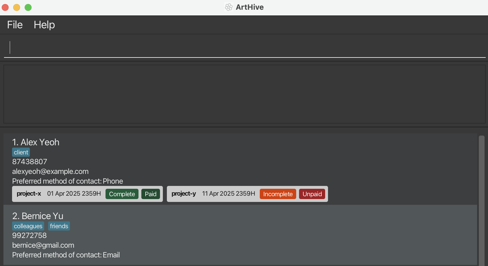
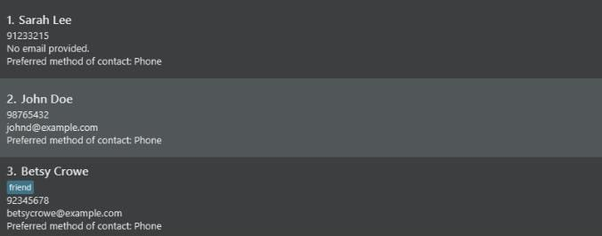
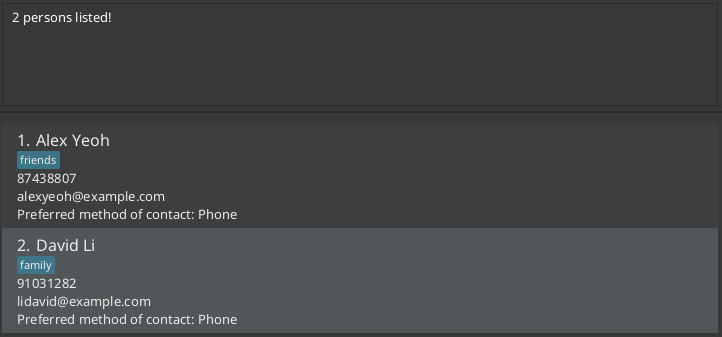
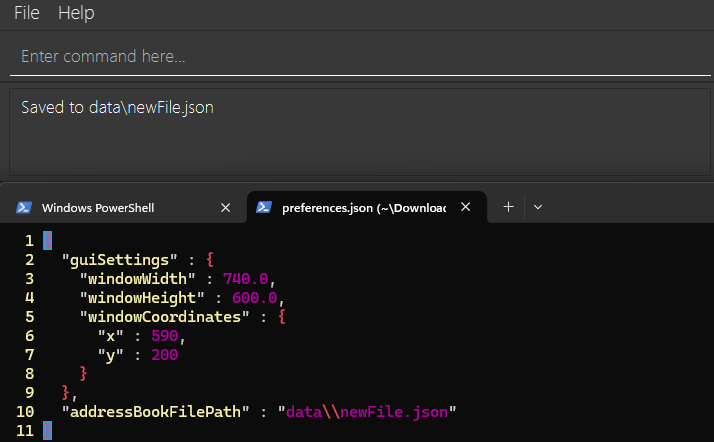

ArtHive is a **desktop application for artists to manage clients and commissions**, optimized for use via a Command Line Interface** (CLI) while still having the benefits of a Graphical User Interface (GUI). If you can type fast, ArtHive can get your tasks done faster than traditional GUI apps.

* Table of Contents
{:toc}

--------------------------------------------------------------------------------------------------------------------

## Quick start

1. Ensure you have Java `17` or above installed in your Computer. 
   **Mac users:** Ensure you have the precise JDK version prescribed [here](https://se-education.org/guides/tutorials/javaInstallationMac.html).

1. Download the latest `.jar` file from [here](https://github.com/AY2425S2-CS2103-F10-1/tp/releases).

1. Copy the file to the folder you want to use as the _home folder_ for ArtHive.

1. Open a command terminal, `cd` into the folder you put the jar file in, and use the `java -jar arthive.jar` command to run the application. 
   A GUI similar to the below should appear in a few seconds. Note how the app contains some sample data. 
   

1. Type the command in the command box and press Enter to execute it. e.g. typing **`help`** and pressing Enter will open the help window. 
   Some example commands you can try:

   * `list` : Lists all contacts.

   * `add n/John Doe p/98765432 e/johnd@example.com` : Adds a contact named `John Doe` to ArtHive.

   * `delete 3` : Deletes the 3rd contact shown in the current list.

   * `clear` : Deletes all contacts.

   * `exit` : Exits the app.

1. Refer to the [Features](#features) below for details of each command.

--------------------------------------------------------------------------------------------------------------------

## Features

**:information_source: Notes about the command format:** 

* Words in `UPPER_CASE` are the parameters to be supplied by the user. 
  e.g. in `add n/NAME`, `NAME` is a parameter which can be used as `add n/John Doe`.

* Items in square brackets are optional. 
  e.g `n/NAME [t/TAG]` can be used as `n/John Doe t/friend` or as `n/John Doe`.

* Items with `…`​ after them can be used multiple times including zero times. 
  e.g. `[t/TAG]…​` can be used as ` ` (i.e. 0 times), `t/friend`, `t/friend t/family` etc.

* Parameters can be in any order. 
  e.g. if the command specifies `n/NAME p/PHONE_NUMBER`, `p/PHONE_NUMBER n/NAME` is also acceptable.

* Extraneous parameters for commands that do not take in parameters (such as `help`, `list`, `exit` and `clear`) will be ignored. 
  e.g. if the command specifies `help 123`, it will be interpreted as `help`.

* If you are using a PDF version of this document, be careful when copying and pasting commands that span multiple lines as space characters surrounding line-breaks may be omitted when copied over to the application.

### Viewing help : `help`

Shows a message explaning how to access the help page.

Format: `help`

### Listing all persons : `list`

Shows a list of all persons in ArtHive.

Format: `list`

### Adding a person: `add`

Adds a person to ArtHive.

Format: `add n/NAME p/PHONE_NUMBER [e/EMAIL] [t/TAG]…​`

:bulb: **Tip:**
A person can have any number of tags (including 0).

:bulb: **Tip:**
The email address is optional. You can choose to leave it blank if you prefer not to provide it.

* Name can only contain alphanumeric characters, spaces, a max of 40 characters and should not be blank.
* Phone numbers should be exactly 8 digits long, beginning with either 6, 8 or 9.
* Email address must be in a valid format (i.e. username@domain.com), without spaces.
* Tags can only contain alphanumeric characters with underscore and hyphens, and be between 1 and 20 characters long.

Examples:
* `add n/Sarah Lee p/91233215`
* `add n/John Doe p/98765432 e/johnd@example.com`
* `add n/Betsy Crowe t/friend e/betsycrowe@example.com p/92345678`

  

### Editing a person : `edit`

Edits an existing person in ArtHive.

Format: `edit INDEX [n/NAME] [p/PHONE] [e/EMAIL] [t/TAG]…​`

* Edits the person at the specified `INDEX`. The index refers to the index number shown in the displayed person list. The index **must be a positive integer** 1, 2, 3, …​
* At least one of the optional fields must be provided.
* Existing values will be updated to the input values.
* When editing tags, the existing tags of the person will be removed i.e adding of tags is not cumulative.
* You can remove all the person’s tags by typing `t/` without
    specifying any tags after it.

Examples:
*  `edit 1 p/91234567 e/johndoe@example.com` Edits the phone number and email address of the 1st person to be `91234567` and `johndoe@example.com` respectively.
*  `edit 2 n/Betsy Crower t/` Edits the name of the 2nd person to be `Betsy Crower` and clears all existing tags.

### Locating persons by name: `find`

Finds persons whose names contain any of the given keywords.

Format: `find KEYWORD [MORE_KEYWORDS]`

* The search is case-insensitive. e.g `hans` will match `Hans`
* The order of the keywords does not matter. e.g. `Hans Bo` will match `Bo Hans`
* The search must only contain alphabetic characters.
* Only the name is searched.
* Only full words will be matched e.g. `Han` will not match `Hans`
* Persons matching at least one keyword will be returned (i.e. `OR` search).
  e.g. `Hans Bo` will return `Hans Gruber`, `Bo Yang`

Examples:
* `find John` returns `john` and `John Doe`
* `find alex david` returns `Alex Yeoh`, `David Li` 
  

### Locating persons by number: `find`

Finds persons whose phone numbers contain any of the given keywords.

Format: `find KEYWORD [MORE_KEYWORDS]`

* The order of the keywords does not matter. e.g. `88888888 66666666` will match `66666666 88888888`
* The search must only contain numerals.
* Only the phone number is searched.
* Only full phone numbers will be matched e.g `888` will not match `88888888`

Examples:
* `find 87438807` returns `Alex Yeoh`
* `find 87438807 99272758` returns `Alex Yeoh`, `Bernice Yu`  
  

### Deleting a person : `delete`

Deletes the specified contact in the current displayed contact list from ArtHive.

**Format:** `delete INDEX` **or** `delete p/PHONE_NUMBER`

* Deletes the contact at the specified `INDEX` **or** with the specified `PHONE_NUMBER`.
* The `INDEX` refers to the index number shown in the displayed contact list and **must be a positive integer** (1, 2, 3, …).
* The `PHONE_NUMBER` must be an exact 8-digit phone number and must belong to a contact in the current displayed contact list.
* **One and only one** of `INDEX` or `p/PHONE_NUMBER` must be provided. 

**Examples:**
* `list` followed by `delete 2` deletes the 2nd contact in ArtHive.
  
* `list` followed by `delete p/93210283` deletes the contact with phone number 93210283.
  
* `find Betsy` followed by `delete 1` deletes the 1st contact in the results of the `find` command.

### Adding a tag : `tag`

Adds a tag to an existing person in ArtHive.

Format: `tag p/PHONE t/TAG [t/TAG]…​`

* Adds one or more tags to the person specified by `PHONE`.
* Unlike editing tags, the existing tags of the person will not be removed i.e adding of tags is cumulative.
* Tags can only contain alphanumeric characters with underscore and hyphens, and be between 1 and 20 characters long.

Examples:
*  `tag p/81234567 t/project-x` Adds a tag `project-x` to the person who has the phone number `81234567`.
*  `tag p/91234567 t/project-y t/Project_z` Adds the tags `project-y` and `Project_z` to the person who has the phone number `91234567`.
   

### Removing a tag : `untag`

Removes a tag from an existing person in ArtHive.

Format: `untag p/PHONE t/TAG [t/TAG]…​`

* Removes one or more tags from the person specified by `PHONE`, if it exists.
* Tags can only contain alphanumeric characters with underscore and hyphens, and be between 1 and 20 characters long.
* If a tag does not exist, the remove operation will still complete successfully without any errors or warnings. No additional checks, other than validity of tags, are performed before attempting the removal.

Examples:
*  Person A with phone number `81234567` has no tags. `untag p/81234567 t/project-x` makes no change and returns a successful untag message.
  *  Person B with phone number `91234567` has two tags `project-y` and `Project_z`. `untag p/91234567 t/project-y` removes the tag `project-y` only.
     

### Saving the data : `save`

Saves ArtHive data in the hard disk via passive (automatic) save or active (manual) save. Passive save activates after any command that changes the data. Active save activates when the user type in `save` as the command. This can be coupled with a [filename] parameter to change the name of the saved file. Upon changing the saved file name, all subsequent saves will be written to the new file.

Format: `save [filename]`

* Saves the data to the hard disk.

Examples:
* `save` proceeds to save the data to the filename pointed in `preferences.json`.

* `save newFile` proceeds to save the data to `newFile.json`, deletes old saved file, and updates `preferences.json`.

#### Editing the data file

ArtHive data are saved automatically as a JSON file `[JAR file location]/data/[filename].json`. Advanced users are welcome to update data directly by editing that data file.

:exclamation: **Note:**
[filename] refers to the saved file name that is specified in `preferences.json`

:exclamation: **Caution:**
If your changes to the data file makes its format invalid, ArtHive will discard all data and start with an empty data file at the next run. Hence, it is recommended to take a backup of the file before editing it. 
Furthermore, certain edits can cause ArtHive to behave in unexpected ways (e.g., if a value entered is outside of the acceptable range). Therefore, edit the data file only if you are confident that you can update it correctly.

### Clearing all entries : `clear`

Clears all entries from ArtHive.

Format: `clear`

### Exiting the program : `exit`

Exits the program.

Format: `exit`

--------------------------------------------------------------------------------------------------------------------

## FAQ

**Q**: How do I transfer my data to another computer? 
**A**: Install the app in the other computer and overwrite the empty data file it creates with the file that contains the data of your previous ArtHive home folder.

--------------------------------------------------------------------------------------------------------------------

## Known issues

1. **When using multiple screens**, if you move the application to a secondary screen, and later switch to using only the primary screen, the GUI will open off-screen. The remedy is to delete the `preferences.json` file created by the application before running the application again.
2. **If you minimize the Help Window** and then run the `help` command (or use the `Help` menu, or the keyboard shortcut `F1`) again, the original Help Window will remain minimized, and no new Help Window will appear. The remedy is to manually restore the minimized Help Window.

--------------------------------------------------------------------------------------------------------------------

## Command summary

Action | Format, Examples
--------|------------------
**Help** | `help`
**List** | `list`
**Add** | `add n/NAME p/PHONE_NUMBER [e/EMAIL] [t/TAG]…​`   e.g., `add n/James Ho p/91234567 e/jamesho@example.com t/friend t/colleague`
**Edit** | `edit INDEX [n/NAME] [p/PHONE_NUMBER] [e/EMAIL] [t/TAG]…​`  e.g.,`edit 2 n/James Lee e/jameslee@example.com`
**Find** | `find KEYWORD [MORE_KEYWORDS]`  e.g., `find James Jake` or `find 87487765 88888888`
**Delete** | `delete INDEX`  e.g., `delete 3`
**Tag**  | `tag p/PHONE_NUMBER t/TAG [t/TAG]…​`   e.g., `tag p/91234567 t/project-x`
**Untag**| `untag p/PHONE_NUMBER t/TAG [t/TAG]…​`   e.g., `untag p/91234567 t/project-x`
**Save** | `save [FILENAME]`   e.g., `save newfile`
**Clear** | `clear`
**exit** | `exit`
