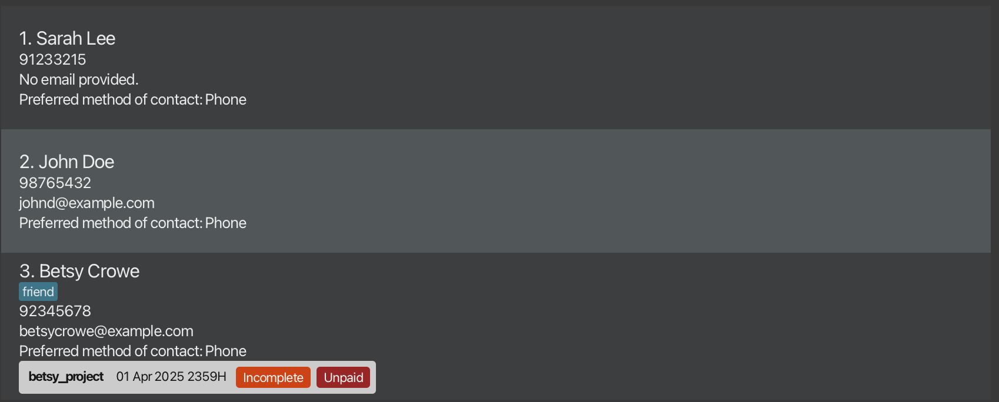
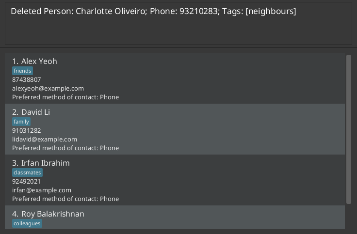
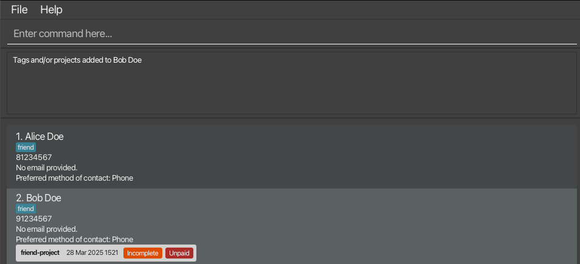
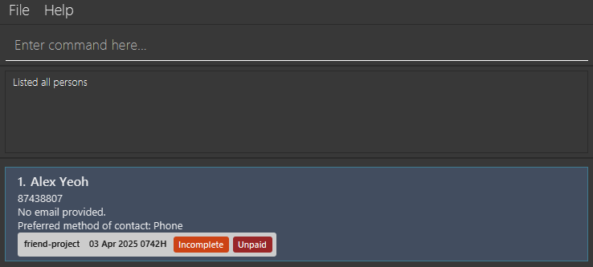
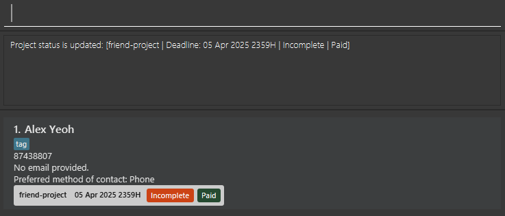
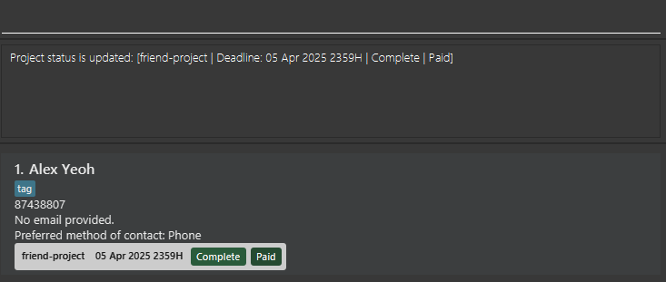

ArtHive is a **desktop application for artists to manage clients and commissions**, optimized for use via a Command Line Interface (CLI) while still having the benefits of a Graphical User Interface (GUI). If you can type fast, ArtHive can get your tasks done faster than traditional GUI apps. 

ArtHive is intended for managing Singapore-based contacts, where phone numbers are 8 digits long and start with 3, 6, 8 or 9.

* Table of Contents
{:toc}

--------------------------------------------------------------------------------------------------------------------

## Quick start

1. Ensure you have Java `17` or above installed in your Computer. 
   **Mac users:** Ensure you have the precise JDK version prescribed [here](https://se-education.org/guides/tutorials/javaInstallationMac.html).

1. Download the latest `.jar` file from [here](https://github.com/AY2425S2-CS2103-F10-1/tp/releases).

1. Copy the file to the folder you want to use as the _home folder_ for ArtHive.

1. Open a command terminal, `cd` into the folder you put the jar file in, and use the `java -jar arthive.jar` command to run the application. 
   A GUI similar to the below should appear in a few seconds. The app may already contain some sample data which may not be the same as shown below. 
   

1. Type the command in the command box and press Enter to execute it. e.g. typing **`help`** and pressing Enter will open the help window. 
   Some example commands you can try:

   * `list` : Lists all contacts.

   * `add n/John Doe p/98765432 e/johnd@example.com` : Adds a contact named `John Doe` to ArtHive.

   * `delete 3` : Deletes the 3rd contact shown in the current list.

   * `clear` : Deletes all contacts.

   * `exit` : Exits the app.

1. Refer to the [Features](#features) below for details of each command.

--------------------------------------------------------------------------------------------------------------------

## Features

**:information_source: Notes about the command format:** 

* Words in `UPPER_CASE` are the parameters to be supplied by the user. 
  e.g. in `add n/NAME`, `NAME` is a parameter which can be used as `add n/John Doe`.

* Items in square brackets are optional. 
  e.g `n/NAME [t/TAG]` can be used as `n/John Doe t/friend` or as `n/John Doe`.

* Items in round brackets with a vertical line `|` indicate a required choice between options. 
  e.g. `(t/TAG | project/PROJECT)` means the user must provide either `t/TAG` or `project/PROJECT`.

* Items with `…`​ after them can be used multiple times including zero times. 
  e.g. `[t/TAG]…​` can be used as ` ` (i.e. 0 times), `t/friend`, `t/friend t/family` etc.

* Parameters can be in any order. 
  e.g. if the command specifies `n/NAME p/PHONE_NUMBER`, `p/PHONE_NUMBER n/NAME` is also acceptable.

* Extraneous parameters for commands that do not take in parameters (such as `help`, `list`, `exit` and `clear`) will be ignored. 
  e.g. if the command specifies `help 123`, it will be interpreted as `help`.

* If you are using a PDF version of this document, be careful when copying and pasting commands that span multiple lines as space characters surrounding line-breaks may be omitted when copied over to the application.

### Viewing help : `help`

Shows a message explaning how to access the help page.

Format: `help`

### Listing all persons : `list`

Shows a list of all persons in ArtHive.

Format: `list`

### Adding a person: `add`

Adds a person to ArtHive.

Format: `add n/NAME p/PHONE [e/EMAIL] [t/TAG]…​ [proj/PROJECT]…​`

:bulb: **Tip:**
A person can have any number of tags and/or projects (including 0).

:bulb: **Tip:**
The email address is optional. You can choose to leave it blank if you prefer not to provide it.

* When specifying a `NAME`, please ensure it follows these rules:
    * **Allowed Characters:**
        * Alphanumeric characters (A-Z, a-z, 0-9)
        * Special characters: `-`, `_`, `.`, `/`, `,` and `'`
        * Maximum length: 40 characters
    * **Not Allowed Characters:**
        * Prefix commands (n/, p/, e/, t/, proj/, by/, pay/, prog/) are NOT allowed
        * Any other special characters outside the allowed list
* `PHONE` should be exactly 8 digits long, beginning with either 3, 6, 8 or 9.
* The `EMAIL` (if provided) must be in a valid email address format (i.e. name@domain.com), without spaces.
* `TAG`/`PROJECT` can only contain alphanumeric characters with underscore and hyphens, and be between 1 and 20 characters long.

Examples:
* `add n/Sarah Lee p/91233215`
* `add n/John Doe p/98765432 e/johnd@example.com`
* `add n/Betsy Crowe e/betsycrowe@example.com p/92345678 t/friend proj/betsy_project`

  

### Editing a person : `edit`

Edits an existing person in ArtHive.

Format: `edit INDEX [n/NAME] [p/PHONE] [e/EMAIL]`

* Edits the person at the specified `INDEX`. The index refers to the index number shown in the displayed person list. The index **must be a positive integer** 1, 2, 3, …​
* Only edits to a person's name, phone number and email address is allowed.
* When specifying a `NAME`, please ensure it follows these rules:
    * **Allowed Characters:**
        * Alphanumeric characters (A-Z, a-z, 0-9)
        * Special characters: `-`, `_`, `.`, `/`, `,` and `'`
        * Maximum length: 40 characters
    * **Not Allowed Characters:**
        * Prefix commands (n/, p/, e/, t/, proj/, by/, pay/, prog/) are NOT allowed
        * Any other special characters outside the allowed list
* The `PHONE` must be an exact 8-digit phone number and must belong to a contact in the current displayed contact list.
* The `EMAIL` (if provided) must be in a valid email address format (i.e. name@domain.com), without spaces.
* At least one of the optional fields must be provided.
* Existing values will be updated to the input values.

Examples:
*  `edit 1 p/91234567 e/johndoe@example.com` Edits the phone number and email address of the 1st person to be `91234567` and `johndoe@example.com` respectively.

  

    
    
<em>Before edit</em>

  

  

    
    
<em>After edit</em>

  

### Locating persons: `find`

Finds persons whose name or phone numbers contain any of the given keywords

Format: `find NAME [NAME]` or  `find PHONE [PHONE]`

* Only one type of search per command is allowed, either by `NAME` (alphabetic characters) or by `PHONE` (integers 0-9).

**Search by NAME**
* The order of the `NAME` does not matter. e.g.`Hans Bo` will match `Bo Hans`.
* The search for `NAME` is case-insensitive. e.g `hans` will match `Hans`
* Leading and trailing whitespaces around each `NAME` keyword will be trimmed. For example, "Hans   " (with trailing spaces) will be treated as "Hans", and "   Hans" (with leading spaces) will also be trimmed.
* Spaces between `NAME` keywords will not be trimmed. For example, "Hans Bo" will be treated as two separate keywords, while "Ha ns" (with a space inside) will remain as-is and will not match "Hans".
* Only the Person's name is searched.
* Only full words will be matched e.g. `Han` will not match `Hans`
* Persons matching at least one keyword will be returned (i.e. `OR` search).
  e.g. `Hans Bo` will return `Hans Gruber`, `Bo Yang`

**Search by PHONE**
* The order of the `PHONE` does not matter. e.g.`88888888 66666666` will match `66666666 88888888`.
* Leading and trailing whitespaces around each `PHONE` keyword will be trimmed. For example, "88888888   " (with trailing spaces) will be treated as "88888888", and "   88888888" (with leading spaces) will also be trimmed.
* Spaces between `PHONE` will not be trimmed. For example, "88888888   66666666" will be treated as two separate keywords, while "8888 8888" (with a space inside a number) will remain as-is and will not match "88888888".
* Only the Person's phone number is searched.
* Only full phone numbers will be matched e.g `888` will not match `88888888`.

Examples:
* `find alex david` returns `Alex Yeoh`, `David Li` 

* `find 87438807 99272758` returns `Alex Yeoh`, `Bernice Yu`  
  

### Deleting a person : `delete`

Deletes the specified contact in the current displayed contact list from ArtHive.

Format: `delete INDEX` or `delete p/PHONE`

* Deletes the contact at the specified `INDEX` **or** with the specified `PHONE`.
* The `INDEX` refers to the index number shown in the displayed contact list and **must be a positive integer** (1, 2, 3, …).
* The `PHONE` must be an exact 8-digit phone number and must belong to a contact in the current displayed contact list.
* **One and only one** of `INDEX` or `p/PHONE` must be provided. 

Examples:
* `list` followed by `delete 2` deletes the 2nd contact in ArtHive.
  

* `list` followed by `delete p/93210283` deletes the contact with phone number 93210283.
  

* `find Betsy` followed by `delete 1` deletes the 1st contact in the results of the `find` command.

### Tagging a Contact with a Tag/Project : `tag`

Assigns a Tag and/or a Project to an existing person in ArtHive.

Format: `tag p/PHONE (t/TAG | proj/PROJECT) [t/TAG]…​ [proj/PROJECT]…​`

* Adds one or more Tags/Projects to the person specified by `PHONE`.
* The `PHONE` must be an exact 8-digit phone number and must belong to a contact in the current contact list.
* In each use of this command, there must be at least one `TAG` or `PROJECT` specified.
* The existing Tags/Projects of the person will not be removed i.e adding of tags is cumulative.
* `TAG`/`PROJECT` can only contain alphanumeric characters with underscore and hyphens, and be between 1 and 20 characters long.
* Projects will have a default values of "Incomplete", "Unpaid", and a deadline set 1 day after creation. Modifications can be made using the `setstatus` command.

Examples:
*  `tag p/81234567 t/friend` Adds a Tag `friend` to the person who has the phone number `81234567`.
*  `tag p/91234567 t/friend proj/friend-project` Adds the Tag`friend` and Project `friend-project` to the person who has the phone number `91234567`.
   

### Untagging a Contact with a Tag/Project : `untag`

Deletes a Tag and/or a Project from an existing person in ArtHive.

Format: `untag p/PHONE (t/TAG | proj/PROJECT) [t/TAG]…​ [proj/PROJECT]…​`

* Removes one or more Tags/Projects from the person specified by `PHONE`, if it exists.
* The `PHONE` must be an exact 8-digit phone number and must belong to a contact in the current contact list.
* In each use of this command, there must be at least one `TAG` or `PROJECT` specified.
* `TAG`/`PROJECT` can only contain alphanumeric characters with underscore and hyphens, and be between 1 and 20 characters long.
* Untagging a Tag/Project from a person deletes the Tag/Project forever.

Examples:
*  Person A with phone number `81234567` has no tags. `untag p/81234567 t/friend` returns an error message as the Tag does not exist.
*  Person B with phone number `91234567` has 1 Tag `friend` and 1 Project `friend-project`. `untag p/91234567 proj/friend-project` removes the Project `friend-project` only.
   

### Updating the status of a Project : `setstatus`

Updates the status of a Project from an existing person in ArtHive.

Format: `setstatus INDEX proj/PROJECT [pay/PAYMENT] [by/DEADLINE] [prog/PROGRESS]`

* Updates the Project tagged to the person at the specified `INDEX`. The `INDEX` refers to the index number shown in the displayed person list. The `INDEX` must be a positive integer 1, 2, 3, …​
* At least one of the optional fields must be provided.
* `PAYMENT` must be either `Paid` or `Unpaid` (case-insensitive).
* `DEADLINE` must be in a `dd MMM uuuu HHmm` format
* `PROGRESS` must be either `Complete` or `Incomplete` (case-insensitive).
* Existing values will be updated to the input values.

Examples:
* `Alex Yeoh` at `INDEX` 1 has a `PROJECT` called `friend-project`.

* `setstatus 1 proj/friend-project pay/paid by/05 Apr 2025 2359` Updates the `PAYMENT` to `Paid` and the `DEADLINE` to `05 Apr 2025 2359`

*`setstatus 1 proj/friend-project prog/complete` Updates the `PROGRESS` to `Complete`

### Saving the data : `save`

Saves ArtHive data in the hard disk via passive (automatic) save or active (manual) save. Passive save activates after any command that changes the data. Active save activates when the user type in `save` as the command. This can be coupled with a [filename] parameter to change the name of the saved file. Upon changing the saved file name, all subsequent saves will be written to the new file.

Format: `save [filename]`

* Saves the data to the hard disk.
* `filename` restrictions:
    * May only contain letters (a-z, A-Z), numbers (0-9), underscore (_), and hyphen (-).
    * No spaces or other special characters are allowed.

Examples:
* `save` proceeds to save the data to the filename pointed in `preferences.json`.

* `save newFile` proceeds to save the data to `newFile.json`, deletes old saved file, and updates `preferences.json`.

#### Editing the data file

ArtHive data are saved automatically as a JSON file `[JAR file location]/data/[filename].json`. Advanced users are welcome to update data directly by editing that data file.

:exclamation: **Note:**
[filename] refers to the saved file name that is specified in `preferences.json`

:exclamation: **Caution:**
If your changes to the data file makes its format invalid, ArtHive will discard all data and start with an empty data file at the next run. Hence, it is recommended to take a backup of the file before editing it. 
Furthermore, certain edits can cause ArtHive to behave in unexpected ways (e.g., if a value entered is outside of the acceptable range). Therefore, edit the data file only if you are confident that you can update it correctly.

### Creating snapshot of data: `snapshot`

Creates snapshot of the existing data in the `snapshots` directory with a datetime stamp ("dMMMuuuu_HHmmss").

Format: `snapshot`

Examples:

* `snapshot` proceeds to create a snapshot of the existing save file with the name represented with the current datetime (e.g., 24Mar2025_172159.json).

### Switching preferred contact : `switchcontact`

Switch preferred contact. 

Format: `switchcontact p/PHONE`

* If the current preferred contact method is email, it will switch to phone.
* If the current preferred contact method is phone, it will switch to email, provided the contact contains an email.
* phone is the default preferred contact method when a contact is created.
* If the contact does not have an email, the preferred contact method will remain as phone.
* The `PHONE` must be an exact 8-digit phone number and must belong to a contact in the current contact list.

Examples:

* `switchcontact p/91234567` Switches the preferred contact method for the contact with phone number 91234567.

### Clearing all entries : `clear`

Clears all entries from ArtHive, and deletes all the data from the savefile.

Format: `clear`

:exclamation: **Caution:**
Successful execution of this command  will cause all contact data to be lost permanently and is irreversible.

  

    
    
<em>Before clear</em>

  

  

    
    
<em>After clear</em>

  

### Exiting the program : `exit`

Exits the program. The application window will close soon after.

Format: `exit`

--------------------------------------------------------------------------------------------------------------------

## FAQ

**Q**: How do I transfer my data to another computer? 
**A**: Install the app in the other computer and overwrite the empty data file it creates with the file that contains the data of your previous ArtHive home folder.

--------------------------------------------------------------------------------------------------------------------

## Known issues

1. **When using multiple screens**, if you move the application to a secondary screen, and later switch to using only the primary screen, the GUI will open off-screen. The remedy is to delete the `preferences.json` file created by the application before running the application again.
2. **If you minimize the Help Window** and then run the `help` command (or use the `Help` menu, or the keyboard shortcut `F1`) again, the original Help Window will remain minimized, and no new Help Window will appear. The remedy is to manually restore the minimized Help Window.

--------------------------------------------------------------------------------------------------------------------

## Command summary

Action | Format, Examples                                                                                                                  
--------|-----------------------------------------------------------------------------------------------------------------------------------
**Help** | `help`                                                                                                                            
**List** | `list`                                                                                                                            
**Add** | `add n/NAME p/PHONE_NUMBER [e/EMAIL] [t/TAG] [proj/PROJECT]…​`   e.g., `add n/James Ho p/91234567 e/jamesho@example.com t/friend p/project-work` 
**Edit** | `edit INDEX [n/NAME] [p/PHONE_NUMBER] [e/EMAIL]`  e.g.,`edit 2 n/James Lee e/jameslee@example.com`                             
**Find** | `find NAME [NAME]` or `find PHONE [PHONE]`   e.g., `find James Jake` or `find 87487765 88888888`                                         
**Delete** | `delete (p/PHONE \| INDEX)`  e.g., `delete 3` or `delete p/87487765`                                                                                              
**Tag**   | `tag p/PHONE (t/TAG \| proj/PROJECT) [t/TAG]…​ [proj/PROJECT]…​`  e.g., `tag p/91234567 t/bestie proj/project-x`      
**UnTag**   | `untag p/PHONE (t/TAG \| proj/PROJECT) [t/TAG]…​ [proj/PROJECT]…​`  e.g., `untag p/91234567 t/bestie proj/project-x`
**setstatus** | `setstatus INDEX proj/PROJECT [pay/PAYMENT] [by/DEADLINE] [prog/PROGRESS]`   e.g., `setstatus 1 proj/milestone1-5 pay/paid by/03 Apr 2025 2359 prog/complete`
**Save** | `save [FILENAME]`   e.g., `save newfile`                                                                                       
**Snapshot** | `snapshot`                                                                                                                        
**Switch Preferred Contact Method** | `switchcontact p/PHONE_NUMBER`   e.g, `switchcontact p/91234567`                                                               
**Clear** | `clear`                                                                                                                           
**Exit** | `exit`                                                                                                                              
